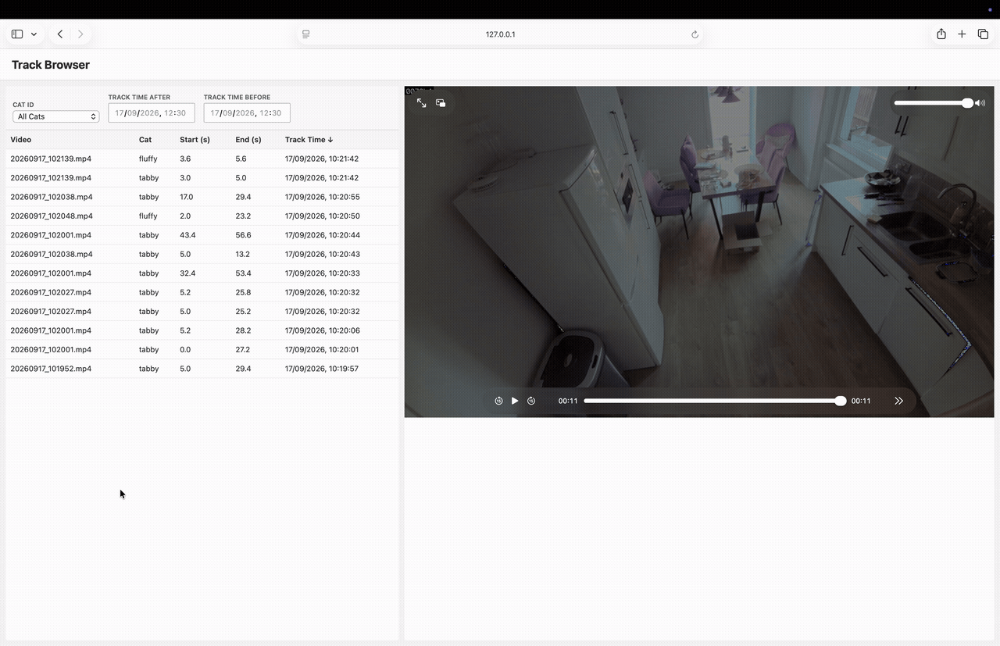
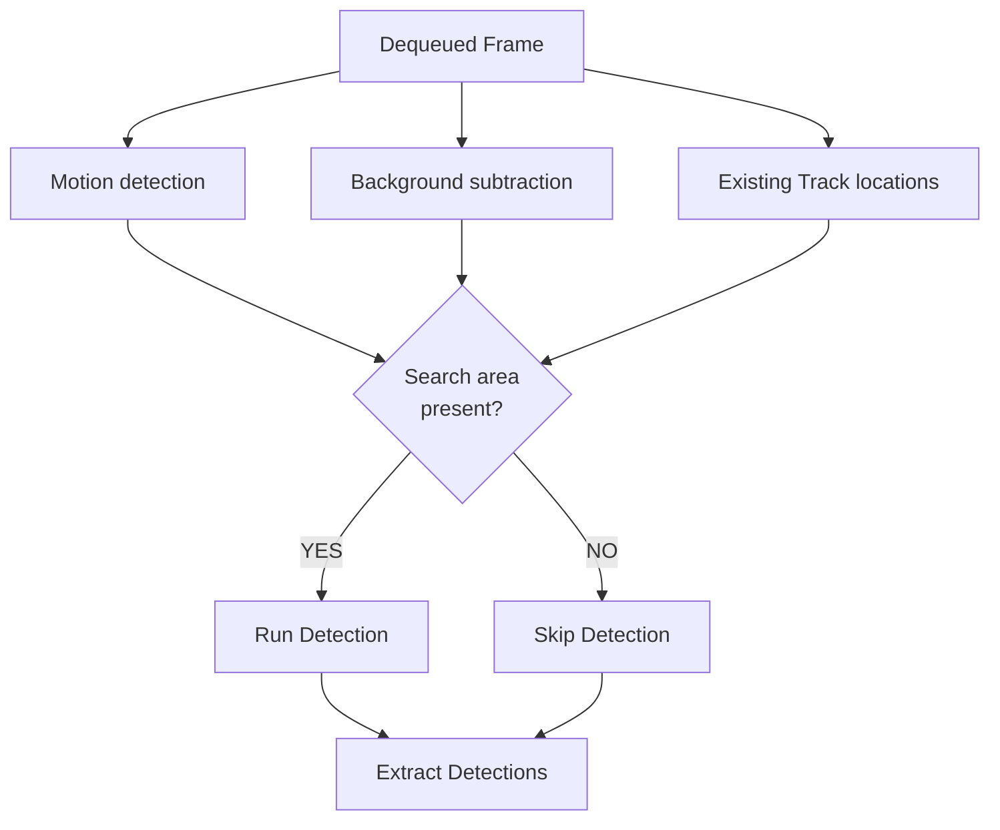
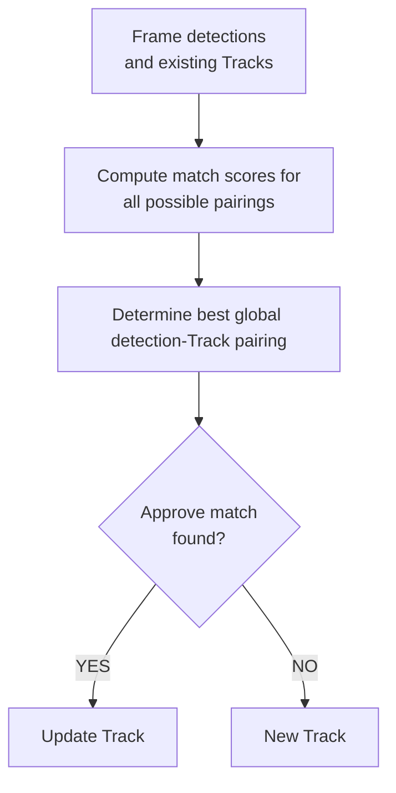
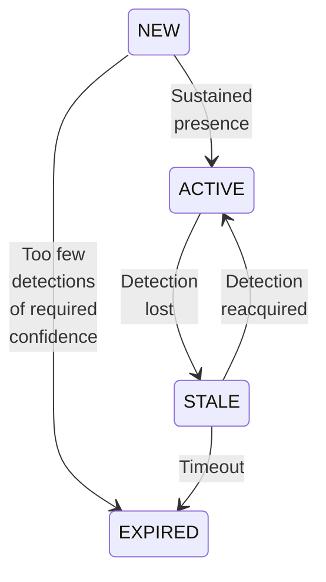
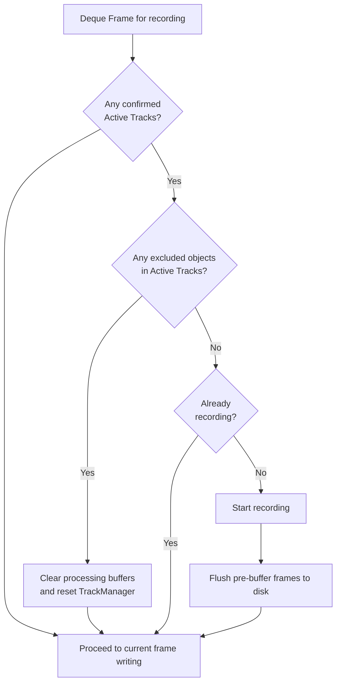
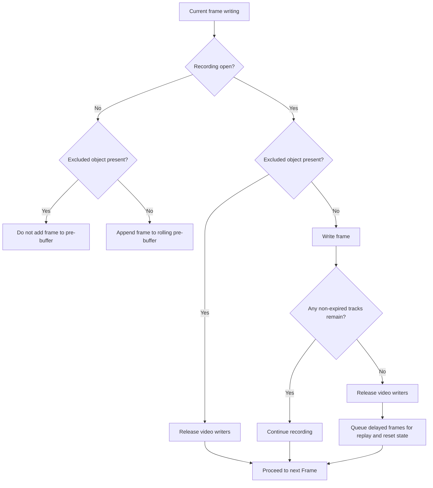

# RPi Cat Behaviour Monitoring

## Purpose

A real-time video monitoring system running on Raspberry Pi that detects cats and people, identifies specific cats and tracks them temporally. If no people are present, the system automatically records annotated video clips with tracking information (IDs, confidence scores, bounding boxes, cat labels). The system uses multi-threaded processing to efficiently handle continuous video capture, motion-aware detection, and recording workflows on resource-constrained hardware.

## Demo



## Logic and Architecture

### Thread-Based Approach

The system uses three threads that synchronise via thread-safe queues and event signals. This approach is taken to avoid delays and buffer in one process blocking other periodic behaviours that require specific timing.

### Capture Thread

Continuously acquires frames from the camera and enqueues them:
1. Acquires raw frame from camera
1. Enqueues the image and timestamp to `frame_queue` for processing

### Processing Thread

The core pipeline. For each frame dequeued, it:
1. Identifies search regions based on observed motion, image foreground and existing tracks
2. Crops image to area of interest and runs object detection
3. Updates Tracks
    - Assigns detections to existing Tracks
    - Updates state of each Track
    - Identifies cat
4. Buffers and records video clips based on track state

#### Object Detection

Areas that have motion, are not background or contain existing tracks are searched using a detection model. If no detections have been run for a period of time, detection will be run on the entire frame.



#### Tracking updates

The system maintains persistent tracks across frames by assigning detections to existing Tracks based on:
- Spatial overlap between detection and forecast Track location
- Detection confidence
- Visual similarity
- Age of most recent detection in Track



#### Tracking State Machine

Tracks move between various states based on the age and confidence of recent detections. These states determine the initialisation and termination of recording as well as annotation of the video.

| State | Description |
|-------|-------|
| **NEW** | Holding state until enough detections of high enough confidence are matched |
| **ACTIVE** | Confirmed Track with detection in current Frame |
| **STALE** | Previously active Track without current detection |
| **EXPIRED** | Tracks that were not confirmed or were stale for too long |



#### Cat Classification

After updating, each Track is re-classified using a confidence-weighted history of appearance embeddings from recent detections. This assigns a cat identity label to the Track and keeps that label stable across short detection gaps. The resulting cat label is used in video annotation, so confirmed cat Tracks are displayed with identity-aware labels rather than only object class labels.

#### Recording

Recording is deliberately decoupled from processing via a buffer to introduce a delay in the recording. The delay enables New Tracks to reach maturity (Active or Expired) before impacting the recording. This avoids small videos initiated by false positives or splitting of large files due to brief false detections of an excluded class.

The exported video relies on a few different components and conditions:
- Rolling pre-detection buffer
    - Maintains a rolling buffer of recent frames
- When a track transitions to Active state
    1. Video recording begins
    1. Pre-buffer frames are flushed to disk (provides context before detection)
    1. Frames are annotated with: track ID, state, frame count, confidence
- While Active tracks exist
    - Frames written continuously if active tracks or are of permitted class
    - Active tracks of excluded class will terminate recording and clear buffers
- When no ACTIVE tracks remain
    - Video file closed

Recording start decision logic:



Post-decision frame handling logic:



Recorded clips are annotated include the following overlays:
- Frame hash
- Per-track lines showing recent history of object lcoation
- Bounding box around the current object position if detected
- Label banner
    - ```<cat name/object type> <track_id> (<cat name confidence>/<object type confidence>) - <state initial><track age>```

## File Structure

### Root Level & Configuration

| File/Directory | Purpose |
|---|---|
| [pyproject.toml](pyproject.toml) | Python project dependencies and metadata |
| [settings.toml](settings.toml) | Application configuration |
| [RPi_setup.md](RPi_setup.md) | Raspberry Pi hardware setup and initialisation guide |
| [src/](src/) | Core application source code |
| [datasets/](datasets/) | Model training and app development datasets |
| [models/](models/) | Trained model files for deployment |
| [models_staging/](models_staging/) | Model experimentation and evaluation |
| [notebooks/](notebooks/) | Jupyter notebooks for analysis, model training and app development |

### Source Files

| File | Purpose |
|---|---|
| [src/app.py](src/app.py) | Main entry point: spawns threads, coordinates graceful shutdown |
| [src/shared.py](src/shared.py) | Shared state and synchronisation primitives: `frame_queue`, `shutdown_event`, camera instance |
| [src/capture.py](src/capture.py) | Camera frame acquisition: reads frames and enqueues to `frame_queue` |
| [src/processing.py](src/processing.py) | Core processing pipeline: object detection, tracking, recording |
| [src/monitoring.py](src/monitoring.py) | Resource monitoring: logs system metrics periodically |
| [src/camera.py](src/camera.py) | Camera abstraction layer: handles different camera backends |
| [src/config.py](src/config.py) | Configuration loader: reads settings from `settings.toml` |
| [src/classification.py](src/classification.py) | Cat identity classification: predicts cat labels from embedding features |
| [src/tracking.py](src/tracking.py) | Tracking system: Hungarian algorithm, Kalman filtering, state machine |
| [src/utils.py](src/utils.py) | Utility functions: bounding box operations, logging helpers |

### Datasets

| Directory | Purpose |
|---|---|
| **classification_data/** | Training data for cat identification and behaviour classification: contains labels and train/validation splits |
| **coco_metadata/** | COCO object detection training data configuration files: base and variant configurations |
| **finetune_data/** | Fine-tuning dataset with images and label annotations |
| **finetune_data_cropped/** | Pre-processed version of fine-tuning data |
| **mock_inputs/** | Raw video for development camera mocking |
| **raw_video/** | Raw video files for offline processing and testing |
